# Wordpress integration in eQual

In this document, we will explain the configuration of wordpress in eQual and how can we display data from eQual in our page in wordpress.

But first, we will see how can we create some tasks in wordpress and then with eQual. We want to create tasks as an example.

## New docker-compose file to install Wordpress.

<details>
<summary>Create or update your docker-compose.yaml file</summary>

**docker-compose.yaml**

```yaml
version: '3'
services:
  equal_srv:
    image: equalframework/equal
    container_name: equal.local
    restart: always
    ports:
      - 80:80
    volumes:
      - /var/www/html
    extra_hosts:
      - "equal.local:127.0.0.1"
    hostname: equal.local
    domainname: local
    environment:
      - EQ_DB_HOST=equal_db
      - EQ_DB_USER=root
      - EQ_DB_PASS=test
      - EQ_DB_NAME=equal
      - WORDPRESS_DB_NAME=equal
      - WORDPRESS_DB_USER=root
      - WORDPRESS_DB_PASSWORD=test
      - WORDPRESS_DB_HOST=equal_db
      - WORDPRESS_DB_CHARSET=utf8
      - WORDPRESS_DB_COLLATE=utf8_unicode_ci
    links:
      - equal_db
    networks:
      - dockerwp
  equal_db:
    image: mysql:5.7
    restart: always
    ports:
      - 3306:3306
    environment:
      - MYSQL_DATABASE=equal
      - MYSQL_ROOT_PASSWORD=test
    networks:
      - dockerwp
  # phpmyadmin
  phpmyadmin:
    depends_on:
      - equal_db
    image: phpmyadmin
    restart: always
    ports:
      - "8080:80"
    environment:
      PMA_HOST: equal_db
      MYSQL_ROOT_PASSWORD: test
    networks:
      - dockerwp

networks:
  dockerwp:

```

Now, open a terminal in the directory your docker-compose.yaml is and run :

```bash
docker compose up -d
```

This will create a new container on docker. If you have docker desktop you can check the containers are running.

**illustration of docker containers in docker desktop**

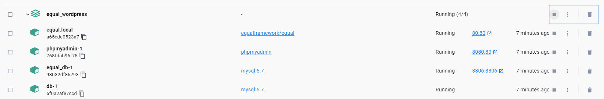

In our case, we have installed phpmyadmin, we will see it below on the worpdress integration section.

### eQual in VS Code

Open you IDE. We use VSCode with dev container extension. To open the container:

Open `Remote Explorer` and click on the container `equal.local` with the arrow on the right and navigate to `cd /var/wwww/html` where the framework is at.
- Equal.local container in Remote explorer in vscode

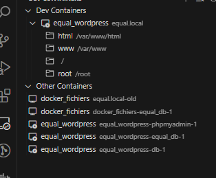


- /public folder in equal container

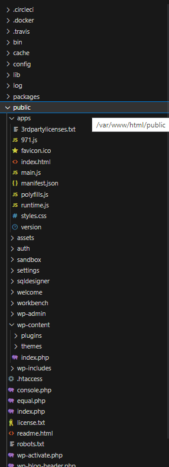


</details>

## Wordpress installation


### Add Worpdress files inside eQual /public

<details>
<summary>Copy Wordpress files in /public/</summary>

1. Go to [wordpress.org](https://wordpress.org/) and download the wordpress 6.3 (current version) zip. Extract all.

    ```
    $> wget --no-check-certificate https://wordpress.org/latest.zip
    ```

In the extracted `wordpress` folder, are all sources files from wordpress.

   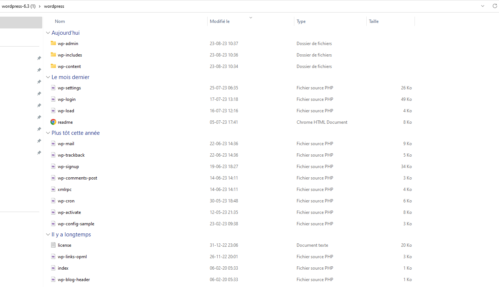

Rename the current `/public/index.php` into `/public/equal.php`
Under `/public/`. This will make the wordpress blog page the page we access when navigating to http://equal.local/.

Select the all files and folder and move them to the`public/wordpress` folder in `equal_wordpress` container.

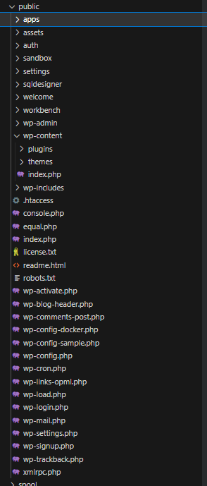

`public/assets/env/config.json`
```json
{
    "production":                   true,
    "parent_domain":                "wpeq.local",
    "backend_url":                  "http://wpeq.local/equal.php",
    "rest_api_url":                 "http://wpeq.local/",
    "lang":                         "en",
    "locale":                       "en",
    "company_name":                 "eQual Framework",
    "company_url":                  "https://yesbabylon.com",
    "app_name":                     "eQual.run",
    "app_logo_url":                 "/assets/img/logo.svg",
    "app_settings_root_package":    "core",
    "version":                      "1.0",
    "license":                      "AGPL",
    "license_url":                  "https://www.gnu.org/licenses/agpl-3.0.en.html"
}
```

- Change your config json
`config/config.json`

```json
{
    "ROUTING_METHOD": "JSON",
    "FILE_STORAGE_MODE":"DB",
    "DEFAULT_RIGHTS": "QN_R_CREATE | QN_R_READ | QN_R_DELETE | QN_R_WRITE",
    "DEBUG_MODE": "QN_MODE_PHP | QN_MODE_ORM | QN_MODE_SQL",
    "DEBUG_LEVEL": "E_ALL | E_ALL",
    "DEFAULT_LANG": "en",
    "DB_REPLICATION": "NO",
    "DB_DBMS": "MYSQL",
    "DB_HOST": "equal_db",
    "DB_PORT": "3306",
    "DB_USER": "root",
    "DB_PASSWORD": "test",
    "DB_NAME": "equal",
    "DEFAULT_PACKAGE": "core",
    "UPLOAD_MAX_FILE_SIZE": "64MB",
    "L10N_TIMEZONE": "Europe/Brussels",
    "L10N_LOCALE": "en",
    "LOGGING_ENABLED": true,
    "DRAFT_VALIDITY": 0,
    "VERSIONING_ENABLED": true,
    "AUTH_SECRET_KEY": "my_secret_key",
    "AUTH_ACCESS_TOKEN_VALIDITY": "1h",
    "AUTH_REFRESH_TOKEN_VALIDITY": "90d",
    "AUTH_TOKEN_HTTPS": false,
    "ROOT_APP_URL": "http://wpeq.local"
}

```

#### Problems

At this point might not be happy about a few things :
A config file is missing. It will need to be created.
- 1 / www-data may not have sufficient rights on files since they were created by root user.
```bash
cd public/
chmod -R 755 ./ && chmod 644 ./.htaccess ./index.php && chmod 640 ./wp-config.php

# If it is not enough
# chmod -R root:www-data .
# ls -la
# chmod -R www-data:www-data .

```

- 2 / .htacces in /public from equal does not allow you to find index.php from wordpress.

Add this .htacces in /public/

**Example of .htacces**

```ruby
Options -Indexes
DirectoryIndex index.php equal.php index.html

# BEGIN WordPress
# The directives (lines) between "BEGIN WordPress" and "END WordPress" are
# dynamically generated, and should only be modified via WordPress filters.
# Any changes to the directives between these markers will be overwritten.
<IfModule mod_rewrite.c>
RewriteEngine On
RewriteRule .* - [E=HTTP_AUTHORIZATION:%{HTTP:Authorization}]
RewriteBase /
RewriteRule ^index\.php$ - [L]
RewriteRule ^userinfo$ equal.php [L,QSA]
RewriteRule ^appinfo$ equal.php [L,QSA]
RewriteRule ^envinfo$ equal.php [L,QSA]
RewriteCond %{REQUEST_FILENAME} !-f
RewriteCond %{REQUEST_FILENAME} !-d
RewriteRule . /index.php [L]
</IfModule>

```

- 3 / Wp-config file is missing : 
You should continue the installation in the browser and wordpress will create it automatically.

**Example of wp-config.php**
<details>
  <summary>Example of wp-config.php</summary>

```php
<?php
/**
 * The base configuration for WordPress
 *
 * The wp-config.php creation script uses this file during the installation.
 * You don't have to use the web site, you can copy this file to "wp-config.php"
 * and fill in the values.
 *
 * This file contains the following configurations:
 *
 * * Database settings
 * * Secret keys
 * * Database table prefix
 * * ABSPATH
 *
 * @link https://wordpress.org/documentation/article/editing-wp-config-php/
 *
 * @package WordPress
 */

// ** Database settings - You can get this info from your web host ** //
/** The name of the database for WordPress */
define( 'DB_NAME', 'equal' );

/** Database username */
define( 'DB_USER', 'root' );

/** Database password */
define( 'DB_PASSWORD', 'test' );

/** Database hostname */
define( 'DB_HOST', 'equal_db' );

/** Database charset to use in creating database tables. */
define( 'DB_CHARSET', 'utf8mb4' );

/** The database collate type. Don't change this if in doubt. */
define( 'DB_COLLATE', '' );

/**#@+
 * Authentication unique keys and salts.
 *
 * Change these to different unique phrases! You can generate these using
 * the {@link https://api.wordpress.org/secret-key/1.1/salt/ WordPress.org secret-key service}.
 *
 * You can change these at any point in time to invalidate all existing cookies.
 * This will force all users to have to log in again.
 *
 * @since 2.6.0
 */
define( 'AUTH_KEY',         'HoPh8x@|>v}AL }@d|`x]bcY :T%:%FFAsp$tO10Mf9/)*MfD0oMwdlygP+dr0XH' );
define( 'SECURE_AUTH_KEY',  'wU}#qmKWMM}V.&oWJ~F$Of} BU,U>|j 1E&gd[$EJ{]nNl7%CiXe*S/u+%#A)0?P' );
define( 'LOGGED_IN_KEY',    'KW<%!uyPd]/S~>kk5KxVt kETp3P6Lo;j*mS<_o4!`wl9+%[Ot1s(6WEF->hP6H8' );
define( 'NONCE_KEY',        'FC!6hglc/0js%1deW[zXj7G-Liu; ~JZZ_m/oq*y?rAs]cwH,vsQ!9M2DEBAi`C^' );
define( 'AUTH_SALT',        'sFA*L42/VRMQ5=hIr5TVFVXktny;v[uatTwx[19!-hO+ ${9:XT=HSda(m[rm;`I' );
define( 'SECURE_AUTH_SALT', 'AoQ8-7)/L=]j6d$Jk7kCd3I%qh8O@=K}`j/P$3px{/aNYGz@-z2CN/b)wR;#@s/u' );
define( 'LOGGED_IN_SALT',   'nt}{;>TR 4_ZI/U0be UtorPma,JIIct^&h,2V+W^|8E|07?JYFP1Smn(fWpZ.!+' );
define( 'NONCE_SALT',       '6@Qw8PoF5Hcvtn$tT$rQ=V5I1iz~a(*nd6L|oK]O|SL-WxT]:%{j -CB^h&ADzh<' );

/**#@-*/

/**
 * WordPress database table prefix.
 *
 * You can have multiple installations in one database if you give each
 * a unique prefix. Only numbers, letters, and underscores please!
 */
$table_prefix = 'wp_';

/**
 * For developers: WordPress debugging mode.
 *
 * Change this to true to enable the display of notices during development.
 * It is strongly recommended that plugin and theme developers use WP_DEBUG
 * in their development environments.
 *
 * @link https://wordpress.org/documentation/article/debugging-in-wordpress/
 */
define( 'WP_DEBUG', false );

/** Absolute path to the WordPress directory. */
// if ( ! defined( 'ABSPATH' ) ) {
	define( 'ABSPATH', __DIR__ . '/' );
// }

/** Sets up WordPress vars and included files. */
require_once ABSPATH . 'wp-settings.php';

```


</details>


Remember to map the default domain name with an IP address in your local hosts file:

    Windows : C:\Windows\System32\drivers\etc\hosts
    Linux : /etc/hosts

etc/hosts
```bash
127.0.0.1	wpeq.local
::1	wpeq.local

```

</details>


### Finish installing Wordpress in your browser
<details>
<summary>Go to http://equal.local/wordpress/</summary>

We can check that `equal_db` is the db host and `equal` database exist in phpmyadmin. The database will be empty at first.
Then, when we will finish the installation by going to https//equal.local/wp-admin/install.php. The `equal` database will be completed with wordpress tables.

Go to http://equal.local/wordpress/ and do the different steps to finish the install. Enter the user and database data as in the docker-compose.yaml.

At the end of the installation should be able to log with the credentials you entered and see the configuration panel at http://equal.local/wordpress/wp-admin.


</details>

### Log in Dashboard

<details>
<summary> Log in Dashboard</summary>
4. We can log in and go on our dashboard. We need to use our credentials from our docker-compose file and also for phpmyadmin.

To have packages from equal in our `equal` database in phpmyadmin, first we have to init core package. If we want to create a new one for wordpress for example, we also need to init this package.


```
./equal.run --do=init_package --package=core
```

To import data :

```
./equal.run --do=init_package --package=projectFlow --import=true
```
To checks :
```
./equal.run --do=test_package-consistency --package=core
```


We can see our equal database with packages from equal and tables for wordpress.

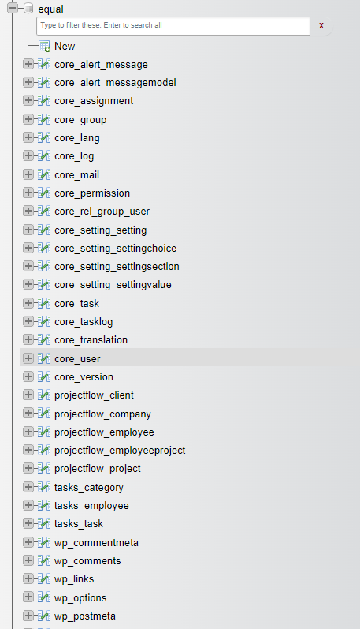

</details>

## Case use of wordpress

###  Introduction
<details>
<summary>Introduction</summary>


## Wordpress in Vs Code

To get some pieces of information from our database and display them in a page we need to use shortcodes.

First, we need to know how can we develop with wordpress in Visual Studio Code.


- open your `src` folder in VS code. We see some directories, the most important directory is `wp_content`.

This is the folder where we will develop.

When we have installed wordpress with our docker-compose, a new src folder was created. This is where we can develop our themes,pages, styles, add functions, etc...

</details>


<details>

<summary>Creating a Wordpress plugin and child theme</summary>

**View of wp-content directory in vscode**
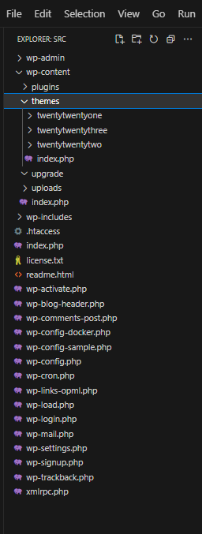

In Wordpress a good practice is to create a child theme if you want to add features so that your features will not be overwritten and erased when the main theme is updated to a new version.
For instance, to create a child theme base on theme Twenty Twenty Four, you just need to create a directory in `public/wordpress/wp-content/themes/twentytwentyfour-child` and add a file inside with some description of the theme.

**public/wordpress/wp-content/themes/twentytwentyfour-child/style.css**
```css
/*
Theme Name:   Twenty Twenty Four Child
Theme URI:    http://example.com/twenty-twentyfour-child/
Description:  Twenty Twenty Four Child Theme
Author:       YesBabylon
Author URI:   http://yesBabaylon.com
Template:     twentytwentyfour
Version:      1.0.0
License:      GNU General Public License v2 or later
License URI:  http://www.gnu.org/licenses/gpl-2.0.html
Tags:         light, dark, two-columns, right-sidebar, responsive-layout, accessibility-ready
Text Domain:  twentytwentyfourchild
*/

```

## Wordpress & eQual working together

At this part of the document, Wordpress is installed in eQual. We will see now how can we develop in Wordpress with eQual.

<details>
<summary>Plugin Equal in admin dashboard in `wp-content/plugins`</summary>

#### 1. Let's create the plugin in `wp-content/plugins`. Create a new folder with the name of your choice for our plugin. Here we will call our plugin `equal`  Then create an `index.php` file and a new folder for js.

1. To create our plugin, add some info in  `index.php` file.

**public/wordpress/wp-content/plugins/equal/index.php**
```php
/**
 * Plugin Name:       equal
 * Plugin URI:        https://yesbabylon.com
 * Description:       Dashboard to use eQual.
 * Version:           1.0.0
 * Requires PHP:      7.4
 * Author:            YesBabylon
 * License URI:       https://www.gnu.org/licenses/gpl-2.0.html
 * Text Domain:       yb-lms
 */
```

2.   Then, go on your Wordpress dashboard, in plugins, we need to activate our new plugin.

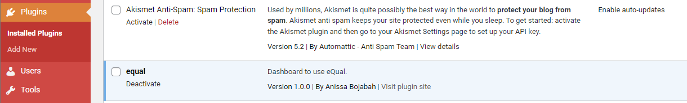


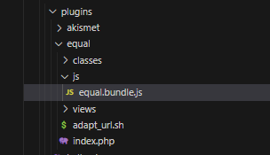

 We will copy the `equal.bundle.js` file in our `js` folder. This file will be used by eQual. Just copy the `equal.bundle.js` file in : `{equal}/public/assets/js/equal.bundle.js` and paste it in `public/wordpress/wp-content/plugins/equal/js/equal.bundle.js`.

To include our `equal.bundle.js` file to our `index.php`, we need to create an action with a function to enqueue script. The `wp_enqueue_style()`   function is a wordpress function to include styles and the `wp_enqueue_script()` function is for scripts.

**public/wordpress/wp-content/plugins/equal/index.php**
```php
<?

// includes styles and scripts in wordpress
add_action('admin_enqueue_scripts', function($hook) {
	$path = plugin_dir_url(__FILE__).'js/equal.bundle.js';


   	wp_enqueue_style('yb_lms_fontawesome', 'https://cdnjs.cloudflare.com/ajax/libs/font-awesome/4.7.0/css/font-awesome.min.css', [], false);
   	wp_enqueue_style('yb_lms_material.fonts', 'https://fonts.googleapis.com/css?family=Roboto:300,400,500,600,700,400italic|Roboto+Mono:400,500|Material+Icons|Google+Material+Icons', [], false);
	wp_enqueue_style('yb_lms_material', 'https://unpkg.com/material-components-web@12.0.0/dist/material-components-web.min.css', [], false);
	wp_enqueue_style('yb_lms_jquery.ui', 'https://code.jquery.com/ui/1.12.0/themes/smoothness/jquery-ui.css', [], false);
	wp_enqueue_style('yb_lms_jquery.daterange', 'https://cdn.jsdelivr.net/npm/daterangepicker/daterangepicker.css', [], false);
	wp_enqueue_script('yb_lms_eq_lib', $path);
});

```
</details>
<details>
Now, we want to display our plugin in our wordpress dashboard. To do that, we need to create a menu.

In our case, we want to have a menu called  `equal UI`, and display clients from our User entity from our core package.

In our Menu, we want to display our client.list.default view from our core package. And to do that, the `equal_bundle.js` file will get the infos,from equal and display them in our menu.

<summary>eQual in Menu</summary>

```php
// [...]
add_action('admin_menu', function () {
    add_menu_page('LMS configuration', 'eQual UI', 'manage_options', 'lms_config', 'Menu::showLMSConfig', 'dashicons-block-default');
});

class Menu {
    /**
     * Display the dashboard
     */
    public static function showLMSConfig() {


        echo <<<EOT
        <script>

        var menu = [
            {
                name: 'Users',
                description: '',
                icon: 'school',
                type: 'parent',
                children: [
                    {
                        name: 'Users',
                        description: '',
                        icon: '',
                        type: 'entry',
                        entity: 'core\\\\User',
                        target: 'list.default'
                    },
                    {
                        name: 'Groups',
                        description: '',
                        icon: '',
                        type: 'entry',
                        entity: 'core\\\\Group',
                        target: 'list.default'
                    }
                ]
            },
            {
                name: 'Tasks',
                description: '',
                icon: 'school',
                type: 'parent',
                children: [
                    {
                        name: 'Tasks',
                        description: '',
                        icon: '',
                        type: 'entry',
                        entity: 'core\\\\Task',
                        target: 'list.default'
                    }
                ]
            }
        ];

        $(document).ready(function() {
            console.log( "ready!" );

            var eq = new eQ('eq-listener');
            eq.loadMenu(menu);

            var context = {
                entity:     'core\\\\User',
                type:       'list',
                name:       'default',
                domain:     [],
                mode:       'view',
                lang:		'en'
            };

            const queryString = window.location.search;
            const urlParams = new URLSearchParams(queryString);

            // overload environment lang if set in URL
            if(urlParams.has('lang')) {
                context['lang'] = urlParams.get('lang');
            }

            eq.open(context);


        });
        </script>
        <div id="sb-menu" style="height: 30px;"></div>
        <div id="sb-lang" style="position: absolute;top: 10px;right: 20px;"></div>
        <div id="sb-container" style="margin-top: 20px;"></div>
        EOT;

    }
}

```


As we can see below in the picture, eQual Users from core package are displayed. The `client.list.default` is now in the menu.

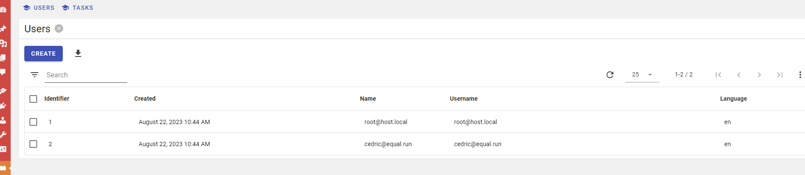

</details>

<details>

<summary>Create a new user, validate and log in</summary>

Now, for our tasks, we want to create a new user but when we click on the `create` button, the view form show anything. We need first to create a new account and log in  in equal.local/auth because we don't have the permission. We also need to do some changes in our `.htaccess` file to get the user info with a token.


Rewriting the .htaccess

**public/.htaccess**
```ruby
Options -Indexes
DirectoryIndex index.php equal.php index.html


# BEGIN WordPress
# The directives (lines) between "BEGIN WordPress" and "END WordPress" are
# dynamically generated, and should only be modified via WordPress filters.
# Any changes to the directives between these markers will be overwritten.
<IfModule mod_rewrite.c>
RewriteEngine On
RewriteRule .* - [E=HTTP_AUTHORIZATION:%{HTTP:Authorization}]
RewriteBase /
RewriteRule ^index\.php$ - [L]
RewriteRule ^userinfo$ equal.php [L,QSA]
RewriteRule ^appinfo$ equal.php [L,QSA]
RewriteRule ^envinfo$ equal.php [L,QSA]
RewriteCond %{REQUEST_FILENAME} !-f
RewriteCond %{REQUEST_FILENAME} !-d
RewriteRule . /index.php [L]
</IfModule>

# END WordPress
```

To create a new account :

```bash
./equal.run --do=model_create --entity=core\\User --fields[login]="project@example.com" --fields[password]="project1"
```

To validate the new user :

```bash
./equal.run --do=model_update --entity='core\User' --ids=3 --fields='{validated:true}'
```

Add a user as a member of a given group : this will give the new user permissions ans access to the apps in http://equal.local/apps/ which the group has access to.

```bash
./equal.run --do=group_add-user --group=users --user=3
```

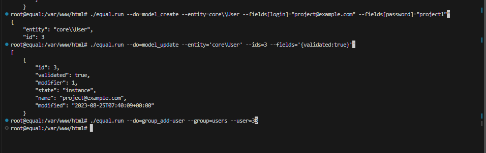

We can check our credentials in our database in phpmyadmin.

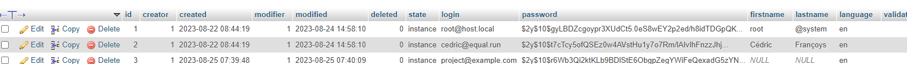

We can log in with our credentials :

Go on : `equal.local/auth`

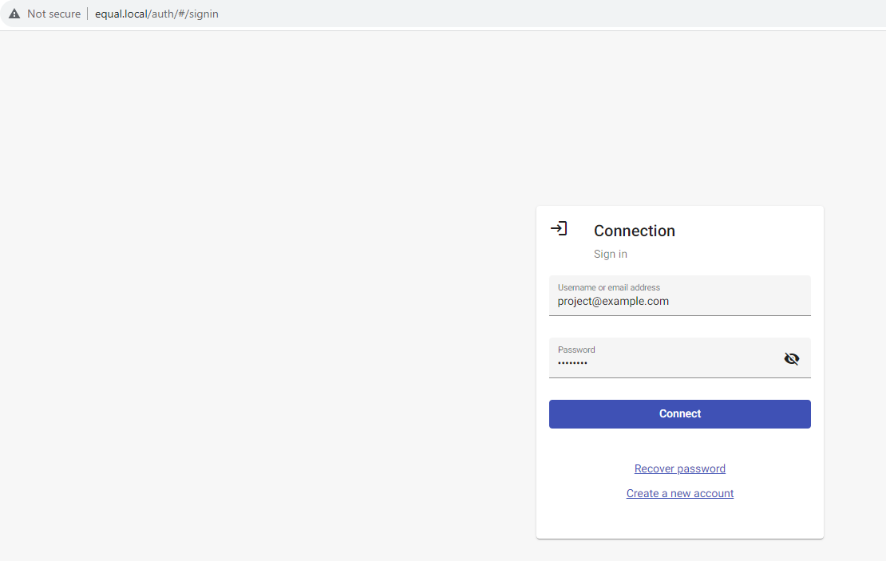

When we click on the `connect` button, we don't redirect on the welcome page but we have our taken in a cookie.


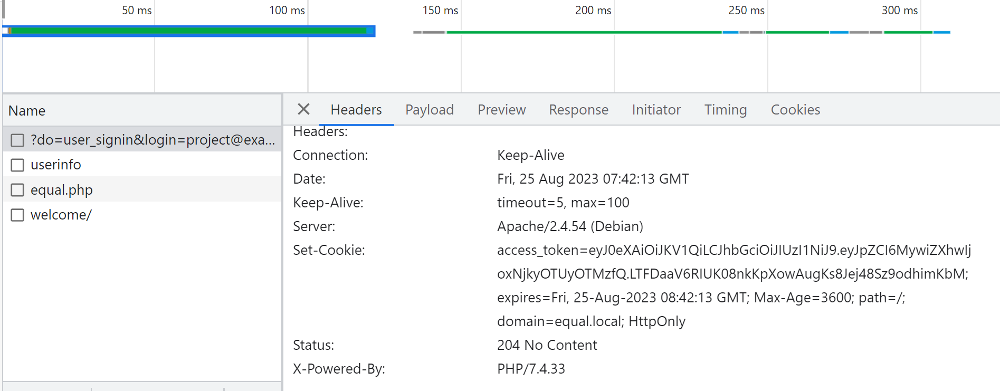

As we can see in our picture, we have our cookie from our log in in `Set-Cookie`. Because of this, we can now go on our form view by the `create ` button.


Now, we have our `htaccess `, when we are logged in, we can see information about our `userinfo` like on the picture below.


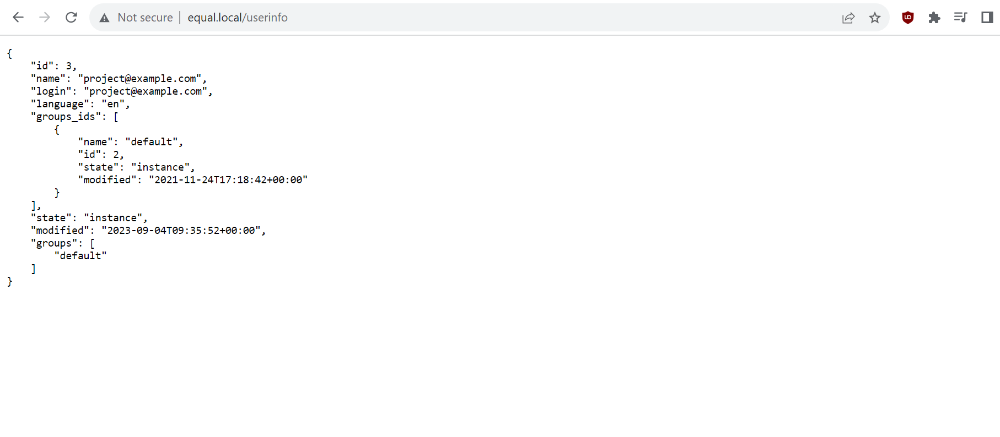

When we go on `equal.local/ `, we have a wordpress welcome page.


</details>


## Displaying tasks with eQual in Wordpress

Now, lets take a package already created so we can quickly start using eQual in worpdress. Let us take projectFlow.

```bash
cd packages/
git clone https://github.com/alexandraYesbabylon/projectFlow projectFlow
cd  /var/www/html
```

This package pro are classes for employees and projects. 
When we have our classes and views, now let us init the package.

#### c/ Init the package

```bash
./equal.run --do=init_package --package=projectFlow --import=true

```

Check the tables are created in the database.

</details>


#### 2. Equal plugin

<details>
<summary>Equal plugin</summary>

   We will use the `equal` plugin in the previous part and activated.

   We have already created a `equal UI` menu, in this menu we will create our tasks, employees and categories.

   ​As we can see in our picture, we have created some tasks. We want to display them in a page with some style.


### `equal` plugin:

Let us create an `index.php` file in our `equal` folder.

Our `eq_init()` function is used to include our `eQual` framework to use in our shortcode in our `equal`plugin.


**/wp-content/plugins/equal/index.php**
```php
<?
/*
* Plugin Name:       equal
* Plugin URI:        https://yesbabylon.com
* Description:       Dashboard to use eQual.
* Version:           1.0.0
* Requires PHP:      7.4
* Author:            YesBabylon
* License URI:       https://www.gnu.org/licenses/gpl-2.0.html
* Text Domain:       yb-lms
*/


/**
 * Init eQual framework by using file eq.lib.php
 */
function eq_init()
{
    if (!function_exists('eQual::init')) {
        // try to include eQual framework
        $eq_bootstrap = '/var/www/html/eq.lib.php';
        // $eq_bootstrap = dirname(__FILE__) . '/../../../../../eq.lib.php';

        if (file_exists($eq_bootstrap)) {
            if ((include_once($eq_bootstrap)) === false) {
                die('missing mandatory dependency');
            }
        }

        if (!is_callable('equal\services\Container::getInstance')) {
            die('missing mandatory declaration for equal\services\Container::getInstance');
        }

        $context = equal\services\Container::getInstance()->get('context');

        if (!$context) {
            die('unable to retrieve mandatory dependency');
        }
        // make sure the original context holds the header of the original HTTP response (set by WORDPRESS)
        // so that it can be restored afterwards
        $context->getHttpResponse();
    }
    if (!is_callable('eQual::run')) {
        throw new Exception('unable to load eQual dependencies');
    }
}


/**
 * Add style from the css file
 */
function twentytwentyfour_enqueue_style()
{
    wp_enqueue_style('twentytwentyfour-child',  plugin_dir_url(__FILE__) . 'css/style.css', [], false, 'all');
}

add_action('wp_enqueue_scripts', 'twentytwentyfour_enqueue_style');

add_action('admin_enqueue_scripts', function ($hook) {
    $path = plugin_dir_url(__FILE__) . 'js/equal.bundle.js'; // copy of 'js/equal.bundle.js in /var/www/html/public/assets/js/equal.bundle.js
    // $project_js = plugin_dir_url(__FILE__) . 'js/task.js'; //
    wp_enqueue_style('yb_lms_fontawesome', 'https://cdnjs.cloudflare.com/ajax/libs/font-awesome/4.7.0/css/font-awesome.min.css', [], false);
    wp_enqueue_style('yb_lms_material.fonts', 'https://fonts.googleapis.com/css?family=Roboto:300,400,500,600,700,400italic|Roboto+Mono:400,500|Material+Icons|Google+Material+Icons', [], false);
    wp_enqueue_style('yb_lms_material', 'https://unpkg.com/material-components-web@12.0.0/dist/material-components-web.min.css', [], false);
    wp_enqueue_style('yb_lms_jquery.ui', 'https://code.jquery.com/ui/1.12.0/themes/smoothness/jquery-ui.css', [], false);
    wp_enqueue_style('yb_lms_jquery.daterange', 'https://cdn.jsdelivr.net/npm/daterangepicker/daterangepicker.css', [], false);
    // wp_enqueue_script('yb_lms_eq_lib', $path, $project_js); // n'existe pas
    wp_enqueue_script('yb_lms_eq_lib', $path); //
});

add_action('admin_menu', function () {
    // equal logo in uri base64
    $logo = "data:image/svg+xml;base64,PD94bWwgdmVyc2lvbj0iMS4wIiBzdGFuZGFsb25lPSJubyI/Pgo8IURPQ1RZUEUgc3ZnIFBVQkxJQyAiLS8vVzNDLy9EVEQgU1ZHIDIwMDEwOTA0Ly9FTiIKICJodHRwOi8vd3d3LnczLm9yZy9UUi8yMDAxL1JFQy1TVkctMjAwMTA5MDQvRFREL3N2ZzEwLmR0ZCI+CjxzdmcgdmVyc2lvbj0iMS4wIiB4bWxucz0iaHR0cDovL3d3dy53My5vcmcvMjAwMC9zdmciCiB3aWR0aD0iMzAwLjAwMDAwMHB0IiBoZWlnaHQ9IjMwMC4wMDAwMDBwdCIgdmlld0JveD0iMCAwIDMwMC4wMDAwMDAgMzAwLjAwMDAwMCIKIHByZXNlcnZlQXNwZWN0UmF0aW89InhNaWRZTWlkIG1lZXQiPgoKPGcgdHJhbnNmb3JtPSJ0cmFuc2xhdGUoMC4wMDAwMDAsMzAwLjAwMDAwMCkgc2NhbGUoMC4xMDAwMDAsLTAuMTAwMDAwKSIKZmlsbD0iIzAwMDAwMCIgc3Ryb2tlPSJub25lIj4KPHBhdGggZD0iTTExMCAxNjcwIGwwIC05MjAgNjA1IDAgNjA1IDAgMCAtMTY1IDAgLTE2NSAxNjUgMCAxNjUgMCAwIDE2NSAwCjE2NSA2MDUgMCA2MDUgMCAwIDkyMCAwIDkyMCAtMTM3NSAwIC0xMzc1IDAgMCAtOTIweiBtMjQyMCAwIGwwIC01OTAgLTQ0MCAwCi00NDAgMCAwIDE2NSAwIDE2NSAtMTY1IDAgLTE2NSAwIDAgLTE2NSAwIC0xNjUgLTQ0MCAwIC00NDAgMCAwIDU5MCAwIDU5MAoxMDQ1IDAgMTA0NSAwIDAgLTU5MHoiLz4KPC9nPgo8L3N2Zz4K";
    $slug = 'equal';
    add_menu_page(__('eQual', 'equal'), __('eQual', 'equal'), 'manage_options', $slug, 'Menu::showEqualPage', $logo);
});


/**
 * Display a menu dashboard
 */
class Menu
{

    /**
     * Display a page equal in the dashboard in wp-admin with the name of the entity for the package projectFlow with a menu in the page and list.views from eQual
     */
    public static function showEqualPage()
    {

        echo <<<EOT
        <script>

        const menu = [
            {
                name: 'Employees',
                description: '',
                icon: 'person',
                type: 'parent',
                children: [
                    {
                        name: 'Employees',
                        description: 'Users of eQual',
                        icon: 'person',
                        type: 'entry',
                        entity: 'projectFlow\\\\Employee',
                        target: 'list.default'
                    },
                    // {
                    //     name: 'Groups',
                    //     description: '',
                    //     icon: 'group',
                    //     type: 'entry',
                    //     entity: 'core\\\\Group',
                    //     target: 'list.default'
                    // }
                ]
            },
            {
                name: 'Projects',
                description: '',
                icon: 'school',
                type: 'parent',
                children: [
                    {
                        name: 'Projects',
                        description: '',
                        icon: '',
                        type: 'entry',
                        entity: 'projectFlow\\\\Project',
                        target: 'list.default'
                    }
                ]
            }
        ];

        $(document).ready(function() {
            var eq = new eQ('eq-listener');
            eq.loadMenu(menu);
            var context = {
                entity:     'projectFlow\\\\Employee',
                type:       'list',
                name:       'default',
                domain:     [],
                mode:       'view',
                lang:		'en'
            };

            const queryString = window.location.search;
            const urlParams = new URLSearchParams(queryString);

            // overload environment lang if set in URL
            if(urlParams.has('lang')) {
                context['lang'] = urlParams.get('lang');
            }

            eq.open(context);


        });
        </script>
        <div id="sb-menu" style="height: 30px;"></div>
        <div id="sb-lang" style="position: absolute;top: 10px;right: 20px;"></div>
        <div id="sb-container" style="margin-top: 20px;"></div>
        EOT;
    }
}
   /**
     * Display a list of projects in the wordpress page the client, employee eQual
     */
function equal_run_shortcode()
{

    try {
        eq_init();

        // gets projects from  projectFlow
        $projects = array_reverse(projectFlow\Project::search()->read(['id', 'name', 'description', 'status', 'budget', 'date', 'employees_ids' => ['id', 'name'], 'client_id' => ['id', 'name'], 'startdate'])->get(true));
        echo '<div class="tasks_title">' . '<h2>' . esc_html("The eQual Flow Projects") . '</h2>' . '</div>';
        echo '<div class="tasks">';

        foreach ($projects as $project_id => $project) {
            echo '<div class="task ' . ($project['status'] == 'approved' ? 'task_green' : 'task_red') . '"' . ' data-id="' . $project_id . '">'
                . '<div class="task_name ' . ($project['status'] == 'draft' ? 'task_name_green' : 'task_name_red') . '" ' . '> Project : ' . esc_html($project['name']) . '</div>';

            echo '<div>Start Date - ' . date('d/m/Y', $project['startdate']) . '</div>';

            echo '<div class="task_description">';
            echo '<div class="cutoff-container">';
            echo '<p class="cutoff-text">Project description : ' . $project['description'] . '</p>';
            echo '</div>';
            echo '</div>';
            echo '<div>' . '<p><strong>Client :</strong> ' . $project['client_id']['name'] . '</p></div>';
            if (count($project['employees_ids']) > 0) {
                echo '<div>' . '<p><strong>Employee :</strong> ';
                foreach ($project['employees_ids'] as $employee) {
                    echo '<span>';
                    echo ($employee['name'] ? $employee['name'] . "," : "");
                    echo ' </span>';
                }
            };
            echo '</div></p></div>';
        }
        // End tasks div.
        echo '</div>';

        // End container
        echo '</div>';
    } catch (Exception $e) {
        $output = "une erreur est survenue : " . $e->getMessage();
    }


    return $output;
}

add_shortcode('equal_projects', 'equal_run_shortcode');

```

Note: To display the tasks, we make sure we have permissions to read data from our controller (@see doc about config)

At this step, we can use our shortcode and put them in our page.

Go to equal.local to your wordpress index page, click on edit page, then add a shortcode component with the shortcode :`[equal_projects]`.

When we go to the wordpress page, we will now see our projects.

</details>